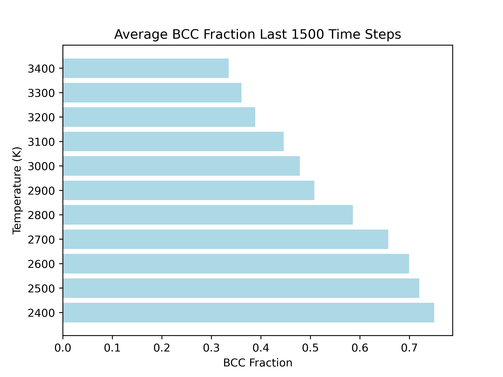

# Tantalum-Melting-Temperature-Lammps
This repository contains a simple implementation of the solid-liquid
coexistence method for the estimation of melting temperature using LAMMPS.
In this repository the melting temperature for tantlum is caluated and is estimated at around 2900K. The lammps potential used here is taken from the FitSNAP repository and is their tantlum neural netork potential example. 

The common neighbor analysis alogorithm in LAMMPS is used to predict the final structure of the simulation. The melting temperature is estimated to be the point at which approximately 50% of the simulation cell remains in the BCC structure and 50% remains as a liquid structure after being allowed to evolve under the NPT ensemble.

This code was used mainly as a demonstration and could probably be improved upon

